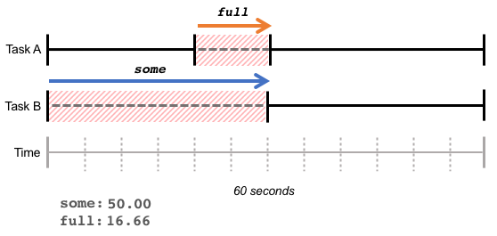

# PSI (Pressure Stall Information for CPU, memory and IO)

在多任务操作系统中，为了完成自己的工作，任务之间互相竞争系统资源(CPU, Memory, I/O)。当系统中资源紧张时，任务因等待资源而产生延迟，甚至导致CPU空闲，浪费计算资源。Linux内核中的PSI模块为实时衡量系统的资源压力提供了量化指标。

## 1. 查看指标
系统的各项压力指标可以通过读取/proc/pressure目录下的cpu, memory, io三个文件来获得。
cpu文件的读取结果如下：
```
some avg10=0.00 avg60=0.00 avg300=0.00 total=0
```
对于memory和io：
```
some avg10=0.00 avg60=0.00 avg300=0.00 total=0
full avg10=0.00 avg60=0.00 avg300=0.00 total=0
```
memory和io有两组指标，some和full，下面会有详细的解释。对于cpu则只有一个some指标。对于每个指标分别显示了最近10s，1分钟，５分钟的平均值。total表示累计延迟时间？

## 2. 关于some和full
some表示系统中有任务因为等待资源而产生的延时占系统运行时间的比例。以下图为例，任务Ｂ等待了30s，占据了总运行时间60s的一半，所以some的值为(30/60) * 100%。


full表示系统中所有任务都因为等待某资源而被延时的时间占总时间的比例。下图中，有10s时间，整个系统没法进行任何计算，所以full的值为(10/60) * 100 %



在一个计算周期内，some和full的时间是累加的。参考下图的例子。


## 3. 代码实现
具体实现包括两个组成部分，数据收集和汇总计算。


### 1. 数据收集
收集数据针对每个CPU独立进行。psi_group结构中有一个struct psi_group_cpu的per-cpu变量。每个特定的CPU上面收集的数据就存储在这里。
```
struct psi_group {
        ...
        /* Per-cpu task state & time tracking */
        struct psi_group_cpu __percpu *pcpu;
        ...
};

struct psi_group_cpu {
        ...
        /* States of the tasks belonging to this group */
        unsigned int tasks[NR_PSI_TASK_COUNTS];
        ...
};
```
这里面首先要关注的就是tasks变量，这个数组记录了分配到该CPU的各种状态的task的数量，具体的状态有三种，定义如下:
```
/* Tracked task states */
enum psi_task_count {
        NR_IOWAIT,
        NR_MEMSTALL,
        NR_RUNNING,
        NR_PSI_TASK_COUNTS = 3,
};
```
该CPU上面运行的task，只要有状态发生，就会调用psi_task_change来更新各种数据。
```
void psi_task_change(struct task_struct *task, int clear, int set)
```
通过函数定义，我们可以看到，该函数负责通知PSI模块，task的那些状态被设置了，哪些状态被清除了。这样数据收集部分就可以准确的维护CPU上各状态下的CPU数量。

```
/*
 * Pressure states for each resource:
 *
 * SOME: Stalled tasks & working tasks
 * FULL: Stalled tasks & no working tasks
 */
enum psi_states {
        PSI_IO_SOME,
        PSI_IO_FULL,
        PSI_MEM_SOME,
        PSI_MEM_FULL,
        PSI_CPU_SOME,
        /* Only per-CPU, to weigh the CPU in the global average: */
        PSI_NONIDLE,
        NR_PSI_STATES = 6,
};

```
### 2. CPU对应的PSI状态判定
PSI状态的判定由下面的test_state函数负责。
```
static bool test_state(unsigned int *tasks, enum psi_states state)
{
        switch (state) {
        case PSI_IO_SOME:
                return tasks[NR_IOWAIT];
        case PSI_IO_FULL:
                return tasks[NR_IOWAIT] && !tasks[NR_RUNNING];
        case PSI_MEM_SOME:
                return tasks[NR_MEMSTALL];
        case PSI_MEM_FULL:
                return tasks[NR_MEMSTALL] && !tasks[NR_RUNNING];
        case PSI_CPU_SOME:
                return tasks[NR_RUNNING] > 1; 
        case PSI_NONIDLE:
                return tasks[NR_IOWAIT] || tasks[NR_MEMSTALL] ||
                        tasks[NR_RUNNING];
        default:
                return false;
        }
}
```
各状态的持续时间储存在struct psi_group_cpu结构中的times数组中。当前状态的起始时间保存在
```
struct psi_group_cpu {
        ...
        /* Period time sampling buckets for each state of interest (ns) */
        u32 times[NR_PSI_STATES];

        /* Time of last task change in this group (rq_clock) */
        u64 state_start;
        ...
};
```

### 3. 汇总计算

# 参考文献
- [Getting Started with PSI](https://facebookmicrosites.github.io/psi/docs/overview).
